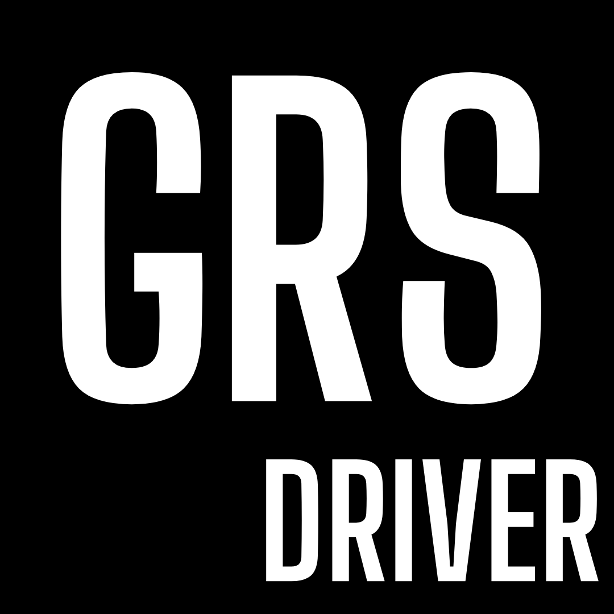
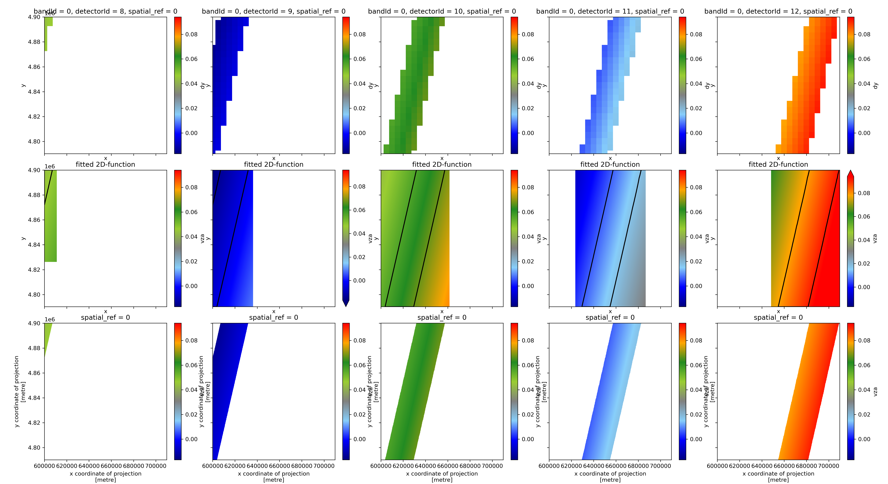
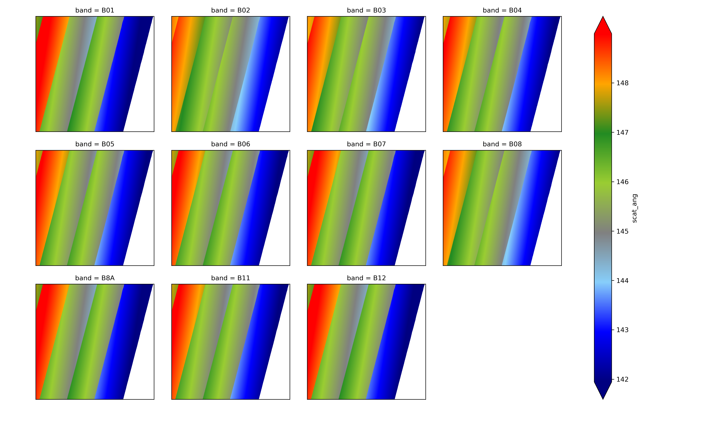
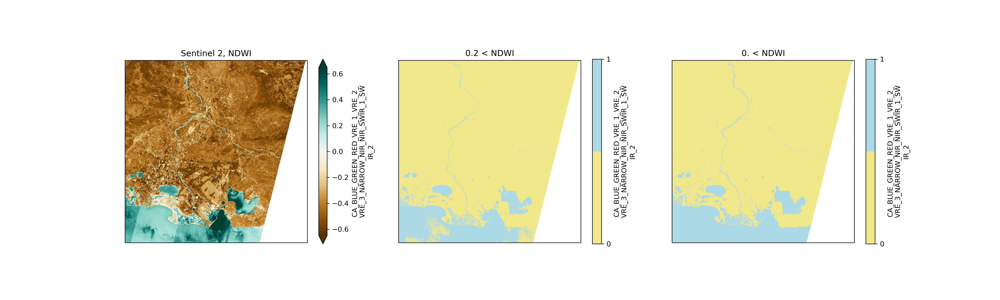

# GRSdriver package
## Driver dedicated to load and prepare data for the GRS processor
- Tool for easy loading of Sentinel-2 L1C SAFE format with accurate computation of the viewing angles
- Applicable to Landsat 8 and 9
- Visualization tools

## Installation

### Usual installation
```commandline
pip install GRSdriver
```

If you have no GDAL implementation yet, please une anaconda environment and install GDAL before GRSdriver:
```commandline
conda install -c conda-forge gdal
```

### Installation from GRSdriver repository (enables use of the notebook and visualization tools)
1. First clone the repository:
```commandline
git clone https://github.com/Tristanovsk/GRSdriver.git
```

2.a. You may duplicate the conda environment (optional)
```commandline
conda env create -f environment.yml
```

2.b. If you do not duplicate the environment please install GDAL with conda
```commandline
conda install -c conda-forge gdal
```

3. Install GRSdriver
```commandline
conda activate grssuite
conda install -c pyviz holoviews panel
pip install .
```

4. Install and configure JupyterLab and Holoviews
```commandline
pip install holoviews datashader cartopy
conda install -c conda-forge jupyterlab
jupyter labextension install @pyviz/jupyterlab_pyviz
```

You are done.


## Example


## 2D-fitting method for angle computation





## Example of water masking


